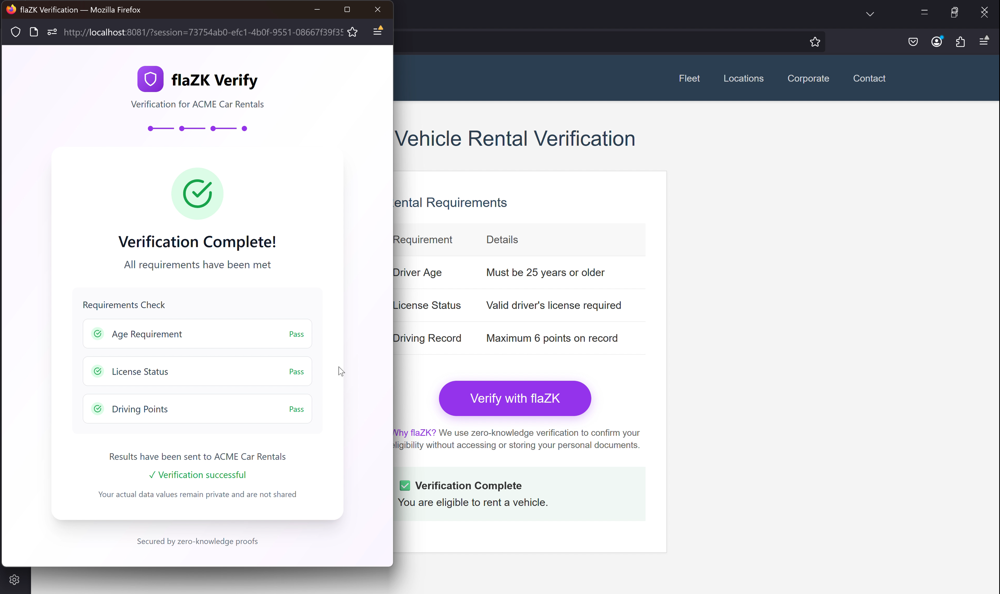

# flaZKFlaZK

## Executive Summary

FlaZK is a zero-knowledge proof system that allows any platform to verify whether a user meets eligibility criteria, such as being over a certain age, holding a valid license, or maintaining a clean driving record, without revealing any personal information. FlaZK solves the growing compliance burden driven by laws like the UK Online Safety Act, which now mandates robust age verification or imposes severe financial penalties and service restrictions.

Today, websites and applications face an impossible choice: expose their users to invasive ID uploads and KYC scans or risk being geoblocked across entire regions like the UK, France, and EU. Meanwhile, privacy laws such as GDPR impose strict limitations on data collection, putting operators in legal limbo and driving user churn.

FlaZK eliminates this tradeoff by providing cryptographic age and license verification using zero-knowledge proofs (ZKPs). Our system allows users to prove they are eligible without revealing birthdate, name, location, or document contents. No data is ever stored, and proof verification is performed entirely client-side.

## How It Works

A platform requests proof using a simple JSON policy (e.g., { "age_min": 25, "license_status": 1, "points_max": 6 }).

The user logs in with a phone number and uploads existing documents (e.g., license, insurance).

Our AI document scanner attempts to fulfill each requirement. If a field cannot be satisfied, the user is prompted to upload more documents.

Each new document is validated using trusted verification agents (e.g., government databases).

Once all fields are met, verified attributes are extracted (e.g., { "age": 26, "license_status": 1, "points": 4 }).

These values are passed to a ZK circuit and used to generate a single cryptographic proof.

The proof is returned to the client in the form { "proof": hash } and verified locally.

Result: Platforms confirm eligibility without accessing or storing any user data.

## Market Potential

Over 300M+ only users require age/license verification annually

Governments are mandating privacy-compliant verification (UK, EU, US)

Over $5B/year is spent on KYC & Compliance Tooling

The global compliance software market exceeds $50B, with a $500M addressable wedge
